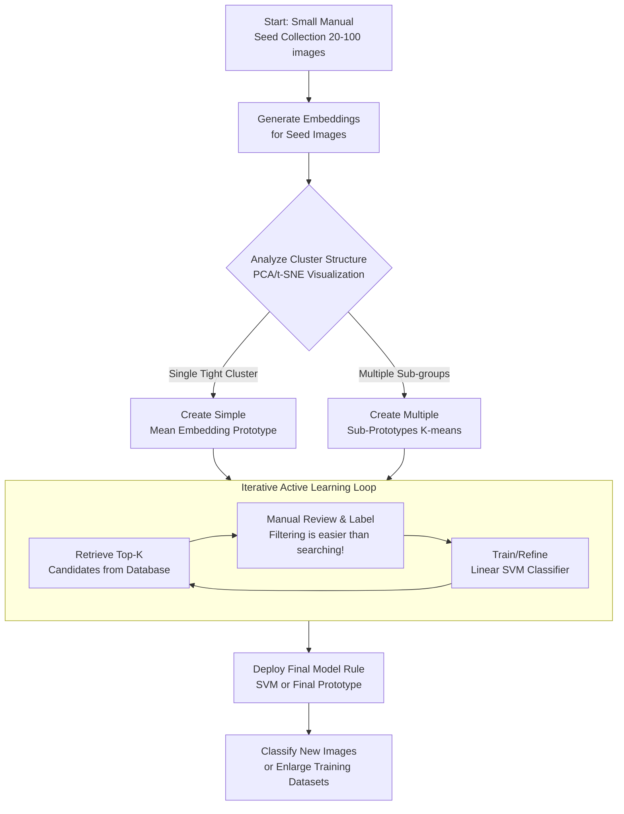

Q:

For long term image classification, I am working on making models that are trained on large datasets. However the task of assembling the datasets is proving to be very onerous and even mentally challenging. I do have a program that is able to gather embeddings of various types from any image-based media, and was wondering if it would be possible to not only make inferences by the cosine similarity with text prompts, which I am already doing with moderate success, but also to detect similarities with a "basket" of similar images. Could an average embedding be taken over multiple images to more closely approximate the model rules I am looking for, as often image embeddings themselves tend to be the best predictor of similar images rather than text.

A:

Excellent question. You've hit upon a central challenge in modern machine learning: moving from brittle, manually assembled datasets to more dynamic, concept-driven data curation. Your intuition is **absolutely correct**.

Using a "basket" of images (a *prototype* or *exemplar set*) to define a classification rule via their embeddings is not only possible, it's a powerful and established technique. It often outperforms text prompts alone because it captures visual nuances and styles that are difficult to articulate in language.

Here’s a breakdown of your idea, methods to improve it, and a practical path forward.

### 1. The Core Idea: Embedding Averaging (Mean Vector)

This is the simplest approach and a great starting point.
*   **How it works:** You take `N` images that represent your target class (e.g., "my specific style of infographic"), run them through your embedding model, and compute the mean (average) of their embedding vectors. This creates a single **prototype vector** for that class.
*   **Inference:** For a new image, compute its embedding and calculate the cosine similarity to this prototype vector. A high similarity indicates membership.
*   **Pros:** Simple, fast, intuitive. Works surprisingly well for cohesive, tight clusters.
*   **Cons:** The mean can be distorted by outliers. It assumes your concept is uniformly distributed in the embedding space, which may not be true for diverse visual concepts.

### 2. Advanced & More Robust Methods

Consider these to handle more complex or diverse "baskets."

#### a) Medoid / Exemplar Selection
Instead of averaging, find the image in your basket whose embedding has the **highest average similarity to all others** in the basket. This *medoid* is an actual, real image and is robust to outliers. You can use the medoid directly or average the `k` most central exemplars.

#### b) Multiple Prototypes / Sub-concept Averaging
A single average might fail for a broad class (e.g., "documentary photo" which could include landscapes, portraits, and close-ups).
*   **Action:** Cluster the embeddings within your basket (using K-means, HDBSCAN). Create a prototype vector for each sub-cluster. During inference, check similarity against *all* sub-prototypes and take the maximum. This captures the "family resemblance" structure.

#### c) SVM or Logistic Regression in Embedding Space
This is a more formal and powerful extension of your idea.
*   **How it works:** Use your "basket" as **positive examples**. You will also need *negative examples* (images clearly *not* in your class). Train a simple linear classifier (like a Support Vector Machine - SVM) directly on the embeddings.
*   **Why it's better:** The classifier learns an optimal *decision boundary* in the embedding space, not just a center point. It automatically determines how to weigh different dimensions of the embedding to separate your positives from negatives. This is far more expressive and robust than a simple mean.

#### d) Building a "Not-This" Vector (Negative Prototype)
To refine your search, define what your class is *not*. Gather a small basket of common false positives or irrelevant images. Create a negative prototype vector. During inference, you can prioritize images that are similar to your positive prototype **and** dissimilar to your negative prototype.
`Final Score = sim(query, positive_proto) - λ * sim(query, negative_proto)`

### 3. Practical Implementation Workflow for Your Project

Here is a step-by-step strategy to integrate this into your pipeline:

1.  **Seed Collection (The Initial Basket):** Manually gather a small, high-quality set (e.g., 20-100 images) that perfectly represents your target concept. This is your last major manual effort for this class.

2.  **Prototype Creation:**
    *   Generate embeddings for all seed images.
    *   **Start Simple:** Compute the mean embedding. This is your `V1_prototype`.
    *   **Analyze:** Use PCA/t-SNE to visualize your seed embeddings. If they form one tight cluster, the mean is perfect. If they form multiple blobs, use the **Multiple Prototypes** method.

3.  **First-Pass Retrieval & Mining:**
    *   Use your `V1_prototype` to scan your large, uncurated database. Retrieve the top-K (e.g., 1000) most similar images.
    *   **This is your first major win:** You've automated the creation of a large, noisy candidate set.

4.  **Active Learning / Iterative Refinement (The Game Changer):**
    *   Manually review the top candidates. This is *far less mentally taxing* than assembling from scratch because you're *filtering*, not searching.
    *   **Label them:** "Yes" (true positive), "No" (false positive).
    *   **Retrain:** Use these new "Yes" and "No" labels to train a **linear SVM** on the embeddings. The SVM now defines `V2_prototype` (as its weight vector).
    *   **Repeat:** Use the SVM to retrieve a new, cleaner batch of candidates. Label a few more. This loop rapidly converges on a high-precision classifier.

5.  **Deployment:**
    *   Your final "model rule" is now either:
        *   A prototype vector (mean or medoid).
        *   A set of prototype vectors.
        *   A trained SVM (`.predict_proba(embedding)` gives a confidence score).
    *   You can use this to classify new images endlessly, or to gather even more data to add to your training dataset for a future neural network.

### 4. Conceptual Alignment: This is "Few-Shot Learning"

What you are describing is the essence of **few-shot** or **prototypical learning**. Models like CLIP are *zero-shot*—they use text only. By using a basket of images, you are giving the model "a few examples" (few-shots) to learn from, which dramatically improves performance on nuanced or specialized concepts.

### Recommendation for Your Next Step

1.  **Immediately implement the Mean Embedding approach.** It's trivial and will give you a baseline. Use it to gather your first candidate sets.
2.  **Visualize your seed embeddings** to understand the structure of your concept.
3.  **Invest one afternoon in setting up an SVM pipeline** (e.g., using `scikit-learn`). The code is minimal—it's just `svm.SVC(kernel='linear').fit(embedding_array, labels_array)`. This will likely be your most robust and maintainable solution.

**Conclusion:** Your instinct to move from text prompts to image exemplar baskets is **the correct and sophisticated direction**. It leverages the true power of your embedding model. By combining simple averaging, visualization, and a dash of lightweight classic ML (SVM), you can build powerful, adaptive classification rules that dramatically reduce the mental toll of dataset assembly. You are essentially building a system that can learn visual concepts by example, much like a human does.

Here's a visual summary of the proposed workflow:

